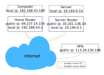

---	
title: Openvpn Client On Server
date: "2020-03-01T12:37:19.357Z"	
description: "Connecting VPN as client from a server without loosing the ssh / vnc connexion"
categories:
  - "tutorial"
  - "network"
---
How to connect to your VPN from your server without loosing the ssh / vnc connexion ?

If you are not interested in the explanation, go the to the [final script](#final-script).

I got this problems some years ago and I was unable to solve it by myself. The answers I found on stack overflow kind of a work but I was unable to understand why. I use this as an occasion to learn more about linux and network and share the solution I found the most effective and simple.

A little diagram about what we want to achieve with my current setup and IPs to make it easy for you to follow.




+ We need to get our Box / Router public ip. From a local shell.
```shell
[mrdotb@local] curl ipinfo.io/ip
49.237.14.154
```
+ Connect to your server.
```shell
[mrdotb@local] ssh mrdotb@35.201.136.114
+ On the server store the ip inside ENV.
```shell
[mrdotb@server] export our_ip="49.237.14.154"
```
+ Why are we loosing access ? 
```shell
[mrdotb@server] ip route show table main
default via 10.140.0.1 dev ens4 proto dhcp src 10.140.0.14 metric 100
10.140.0.1 dev ens4 proto dhcp scope link src 10.140.0.14 metric 100
[mrdotb@server] sudo /usr/sbin/openvpn ./yourconfig.ovpn &
[mrdotb@server] ip route show table main
0.0.0.0/1 via 10.8.0.1 dev tun0
default via 10.140.0.1 dev ens4 proto dhcp src 10.140.0.14 metric 100
10.8.0.0/24 dev tun0 proto kernel scope link src 10.8.0.3
10.140.0.1 dev ens4 proto dhcp scope link src 10.140.0.14 metric 100
113.29.230.196 via 10.140.0.1 dev ens4
128.0.0.0/1 via 10.8.0.1 dev tun0
```
Notice, when you start openvpn it make change to the main [routing table](https://en.wikipedia.org/wiki/Routing_table) and all the traffic will go through the VPN _(tun0)_.
+ In order to keep access we will redirect (incoming / outgoing) packet (to / from) our `$our_ip` to a special route will call `route 22` who is going to be a mirror of our main table before it get modified by openvpn.
```shell
[mrdotb@server] ip route | awk '{print "sudo ip route add table 22 " $0}' | bash
[mrdotb@server] sudo ip rule add from $our_ip table 22
[mrdotb@server] sudo ip rule add to $our_ip table 22
```
+ That's all we need, now we can test using timeout cmd to avoid getting locked out
```shell
[mrdotb@server] timeout 30 /usr/sbin/openvpn yourvpnconfig.ovpn
```
If the shell become unresponsive or you are unable to open a second ssh connexion something is wrong, but it's find you will get access back after the 30 sec timeout. Otherwise, congrats ! You are succesfully connected to your openvpn without loosing your network access.
+ I can't resolve domains anymore ?
```shell
[mrdotb@server] sudo echo "nameserver 8.8.8.8" >> /etc/resolv.conf
[mrdotb@server] sudo echo "nameserver 8.8.4.4" >> /etc/resolv.conf
```
Your openvpn server push some bad routes preventing you to use your local host resolver. Using google DNS is the easiest way to solve the problem.
+ How can I reset all the previous modifications ?
```shell
[mrdotb@server] ip rule delete from $our_ip table 22
[mrdotb@server] ip rule delete to $our_ip table 22
[mrdotb@server] ip route flush table 22
```
You can also reboot the server.


<h3 id="final-script">Final script</h3>

```shell
# save our public ip
# copy main table in table 22
# from / to lookup in table 22
# launch VPN with timeout cmd to prevent lock
export your_ip=`echo $SSH_CLIENT | awk '{ print $1 }'`
ip route | awk '{print "sudo ip route add table 22 " $0}' | bash
sudo ip rule add from $your_ip 22
sudo ip rule add to $your_ip 22
timeout 30 sudo /usr/sbin/openvpn yourvpnconfig.ovpn
```


### Resources
If you want to learn more about linux networks, read [linux-ip](http://linux-ip.net/html/index.html).
